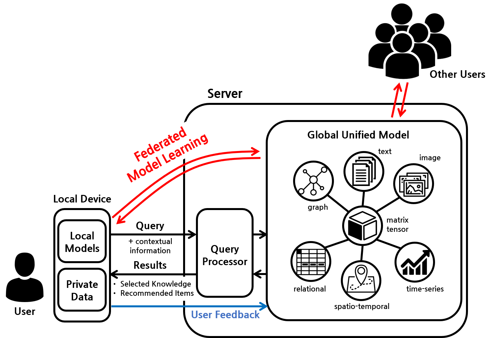
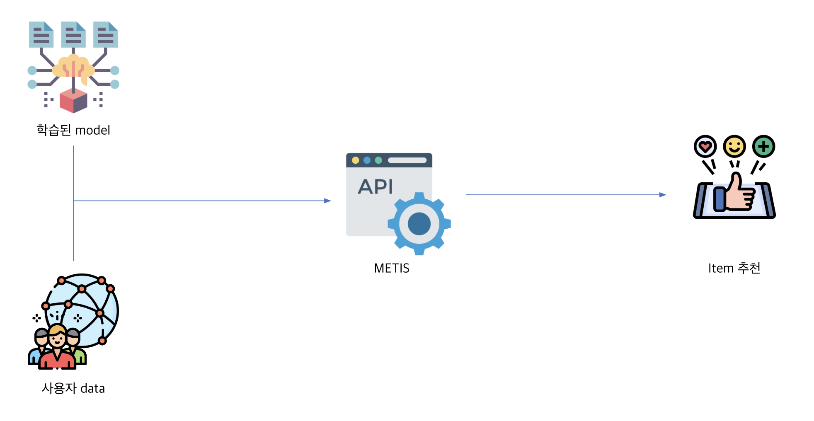
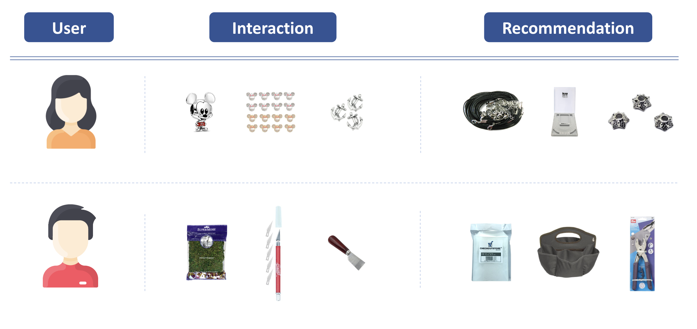
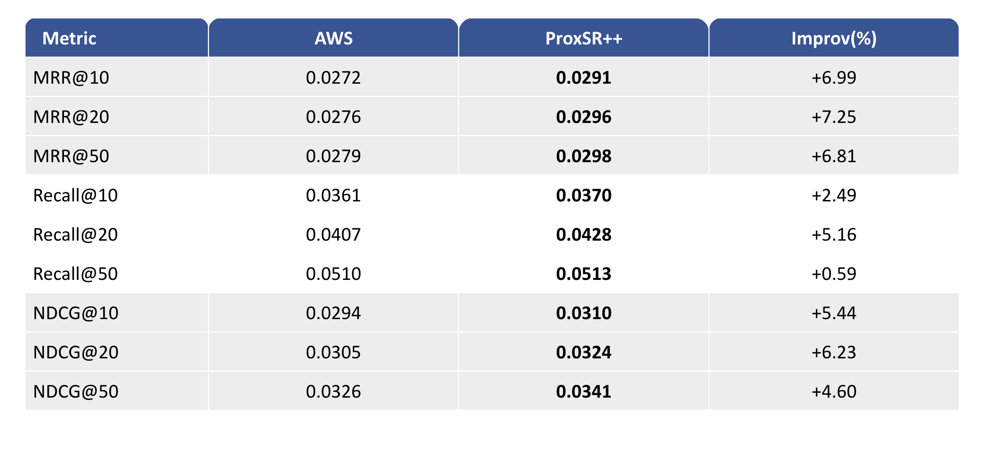

# METIS

"METIS" is a novel and powerful framework which supports to easily implement a decision support system for a target domain, a target purpose, and a target application using large-scale and heterogeneous data.
METIS is short for ML-based Decision Support Information System. 
Based on the next-generation machine learning, it provides selected information that users really need (i.e., supports users’ decisions) by incorporating a variety of heterogeneous data into a unified modeling framework.

Our decision support system has four important and differentiated features compared to existing systems and generic technologies.

# Features

## 1. Multi-modal Learning

It supports easy and effective modeling on large-scale heterogeneous data based on the integrated modeling framework. It flexibly constructs models suitable for target domains, target applications, target services, and target data and learns them efficiently.

## 2. Scalable and Efficient Learning

It manages dynamic data and models by using incremental learning. In other words, it efficiently reflects the data accumulated over time in the model at the previous time-stamp.

## 3. Privacy-Preserving Learning

It preserves the privacy of user data by using federated model learning. It trains global models and improves their performances by considering a lot of user data without accessing users’ local data.

## 4. Incremental Learning

It provides good scalability and efficiency by fully utilizing limited resources. In terms of model learning, it efficiently processes large-scale data that conventionally can not be handled in a local device, where computation and memory resources are limited.

# Inference
For your inference(testing), a pretrained model and a customized dataset should be prepared. Then, item recommendations(i.e., next item predictions) are generated through API calls. If you need more information about the inference phase, please feel free to reach out to us.

# Use Cases
There are two kinds of use cases as shown in the figure below:

(1) A user who had bought pendants was recommended necklace chains, tools for securing necklace chains, and other necklace. In fact, this user actually purchased the tool recommended. 

(2) A user who had bought supplies for woodworking was recommended items such as DIY paper packs, bags, and other woodworking essentials. This user also purchased the woodworking tools suggested by the recommender.

# Performance Comparison
This table presents a performance comparsion between our base model(ProxySR++) and AWS, representing the Amazon Personalize Service. As you can see, our model has demonstrated improvements across all evaluation metrics for item recommendations.

# Authors

#### Principal Investigator (PI)

- Professor Hwanjo Yu (hwanjoyu@postech.ac.kr)

#### Project Manager (PM)

- Ph.D Student Junsu Cho (junsu7463@postech.ac.kr)

# License

The code is licensed under the [MIT License](./LICENSE)
