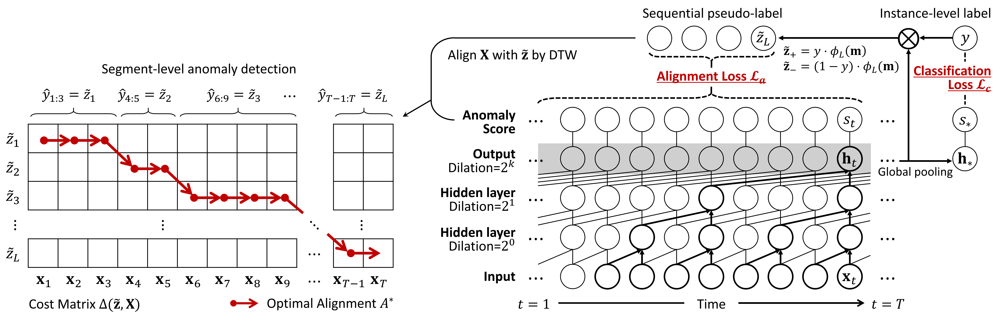

# WETAS: Weakly Supervised Time-Series Anomaly Segmentation

<p align="center">

<br>
	<em> Figure 1. Two different strategies for localizing temporal anomalies. </em>	
</p>

- This is the author code of ["Weakly Supervised Temporal Anomaly Segmentation with Dynamic Time Warping"](https://arxiv.org/abs/2108.06816) (ICCV 2021).
- We employ (and customize) the publicly availabe implementation of soft-dtw, please refer to [this repository](https://github.com/Maghoumi/pytorch-softdtw-cuda).

## Overview

<p align="center">

<br>
	<em> Figure 2. The overall framework of WETAS, optimized by both the classification loss and the alignment loss. </em>
</p>

Our proposed framework, termed as **WETAS**, optimizes the parameters of the dilated CNN by leveraging only weak supervision (i.e., instance-level anomaly labels, rather than point-level anomaly labels).
To fully utilize the given instance-level anomaly labels, two different types of losses are considered (Figure 2, right).

1) **The classification loss** for correctly classifying an input instance as its instance-level anomaly label
2) **The alignment loss** for matching the input instance with the sequential anomaly label, which is synthesized by the model by distilling the instance-level label.

For temporal anomaly segmentation on a test input instance, it utilizes dynamic time warping (DTW) which outputs the optimal alignment between a target instance and the sequential anomaly label (Figure 2, left).

## Run the codes

#### STEP 1. Install the python libraries / packages

- numpy
- numba
- scikit-learn
- pytorch


#### STEP 2. Download the real-world datasets for temporal anomaly segmentation

- You can download the raw datasets from the following links.

  - Electromyography Dataset (EMG) : http://archive.ics.uci.edu/ml/datasets/EMG+data+for+gestures
  - Gasoil Plant Heating Loop Dataset (GHL) : https://kas.pr/ics-research/dataset_ghl_1
  - Server Machine Dataset (SMD) : https://github.com/smallcowbaby/OmniAnomaly
  - Subway Entrance/Exit Dataset (Subway) : available for public use upon request to the authors of [(Adam et al., 2008)](https://ieeexplore.ieee.org/document/4407716)

- You need to split the whole temporal data into a training set, a validation set, and a test set.
- Then, place the files in the corresponding directories.
  - `./data/{DATASET}/train`, `./data/{DATASET}/valid`, and `./data/{DATASET}/test`
- We provide the preprocessed EMG dataset as an example.


#### STEP 3. Train and evaluate the WETAS framework

- You can simply run the code with the default setting, by using the following command.

```
python train_classifier.py
```

- For the EMG dataset, the training process will be printed like as below.

```
Epoch [25/200], step [15/15], Train Loss : 0.561529 (BCE : 0.482434, DTW : 0.079095), Valid loss : 0.530925 (BCE : 0.448849, DTW : 0.082075)
	Valid (WEAK) AUC : 0.850989, AUPRC : 0.537640, Best F1 : 0.597938,  Precision : 0.547619, Recall : 0.605263, threshold : 0.214676
	Test  (WEAK) AUC : 0.894690, AUPRC : 0.655222, Best F1 : 0.634146, Precision : 0.418182, Recall : 0.901961
	Test (DENSE) F1 : 0.040875, Precision : 0.061622, Recall : 0.030579, IoU : 0.020864

Epoch [50/200], step [15/15], Train Loss : 0.387882 (BCE : 0.308741, DTW : 0.079141), Valid loss : 0.441821 (BCE : 0.359525, DTW : 0.082296)
	Valid (WEAK) AUC : 0.896036, AUPRC : 0.738797, Best F1 : 0.688822,  Precision : 0.453125, Recall : 0.763158, threshold : 0.247649
	Test  (WEAK) AUC : 0.899510, AUPRC : 0.743431, Best F1 : 0.742857, Precision : 0.523810, Recall : 0.862745
	Test (DENSE) F1 : 0.560338, Precision : 0.405383, Recall : 0.907055, IoU : 0.389215

Epoch [75/200], step [15/15], Train Loss : 0.351386 (BCE : 0.272270, DTW : 0.079117), Valid loss : 0.461061 (BCE : 0.378665, DTW : 0.082396)
	Valid (WEAK) AUC : 0.906921, AUPRC : 0.783545, Best F1 : 0.716846,  Precision : 0.409091, Recall : 0.710526, threshold : 0.174542
	Test  (WEAK) AUC : 0.905147, AUPRC : 0.777514, Best F1 : 0.763636, Precision : 0.623188, Recall : 0.843137
	Test (DENSE) F1 : 0.580832, Precision : 0.453260, Recall : 0.808342, IoU : 0.409276

Epoch [100/200], step [15/15], Train Loss : 0.319351 (BCE : 0.240257, DTW : 0.079095), Valid loss : 0.394851 (BCE : 0.312770, DTW : 0.082081)
	Valid (WEAK) AUC : 0.931307, AUPRC : 0.826301, Best F1 : 0.763889,  Precision : 0.375000, Recall : 0.868421, threshold : 0.244523
	Test  (WEAK) AUC : 0.917729, AUPRC : 0.807198, Best F1 : 0.773585, Precision : 0.652174, Recall : 0.882353
	Test (DENSE) F1 : 0.603051, Precision : 0.450450, Recall : 0.912017, IoU : 0.431691
```

- You can specify the details of the framework and its optimization by input arguments.

## Citation
```
TBD
```
