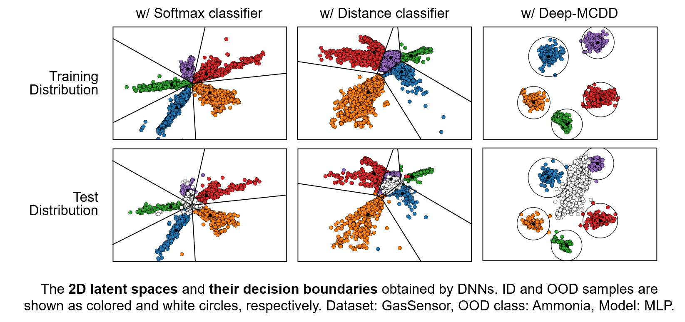

# Multi-class Data Description (Deep-MCDD) for Out-of-distribution Detection

This is the author code of ["Multi-class Data Description for Out-of-distribution Detection"](https://dl.acm.org/doi/abs/10.1145/3394486.3403189).
Some codes are implemented based on [Deep Mahalanobis Detector](https://github.com/pokaxpoka/deep_Mahalanobis_detector).

## Overview

<p align="center">

</p>

## Downloading tabular datasets

The four multi-class tabular datsets reported in the paper can be downloaded from the below links.
We provide the preprocessed version of the datasets, which are converted into the numpy array format, to allow users to easily load them.
For more details of the datasets, please refer to the UCI repository.
Place them in the directory `./table_data/`.

- **GasSensor**: [[Numpy format]](http://di.postech.ac.kr/donalee/deepmcdd/gas_preproc.npy) [[Raw format]](https://archive.ics.uci.edu/ml/datasets/Gas+Sensor+Array+Drift+Dataset#)
- **Shuttle**: [[Numpy format]](http://di.postech.ac.kr/donalee/deepmcdd/shuttle_preproc.npy) [[Raw format]](https://archive.ics.uci.edu/ml/datasets/Statlog+(Shuttle))
- **DriveDiagnosis**: [[Numpy format]](http://di.postech.ac.kr/donalee/deepmcdd/drive_preproc.npy) [[Raw format]](https://archive.ics.uci.edu/ml/datasets/Dataset+for+Sensorless+Drive+Diagnosis)
- **MNIST**: [[Numpy format]](http://di.postech.ac.kr/donalee/deepmcdd/mnist_preproc.npy) [[Raw format]](http://yann.lecun.com/exdb/mnist/)

## Downloading image datasets

The three in-distribution datasets (i.e., **SVHN**, **CIFAR-10**, and **CIFAR-100**) would be automatically downloaded via `torchvision`.
We use the download links of two additional out-of-distributin datasets (i.e., **TinyImageNet** and **LSUN**) from [Deep Mahalanobis Detector](https://github.com/pokaxpoka/deep_Mahalanobis_detector) and [ODIN Detector](https://github.com/ShiyuLiang/odin-pytorch).
Place them in the directory `./image_data/`.

## Running the codes

- python
- torch (GPU version only)

#### Training MLP with Deep-MCDD for tabular data
```
python train_deepmcdd_table.py --dataset gas --net_type mlp --oodclass_idx 0
```

#### Training CNN with Deep-MCDD for image data
```
python train_deepmcdd_image.py --dataset cifar10 --net_type resnet
```

## Citation
```
@inproceedings{lee2020multi,
  author = {Lee, Dongha and Yu, Sehun and Yu, Hwanjo},
  title = {Multi-Class Data Description for Out-of-Distribution Detection},
  year = {2020},
  booktitle = {Proceedings of the 26th ACM SIGKDD International Conference on Knowledge Discovery & Data Mining},
  pages = {1362–1370}
}
```
