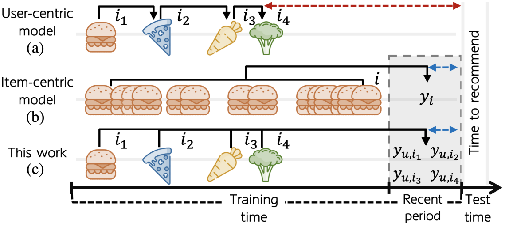
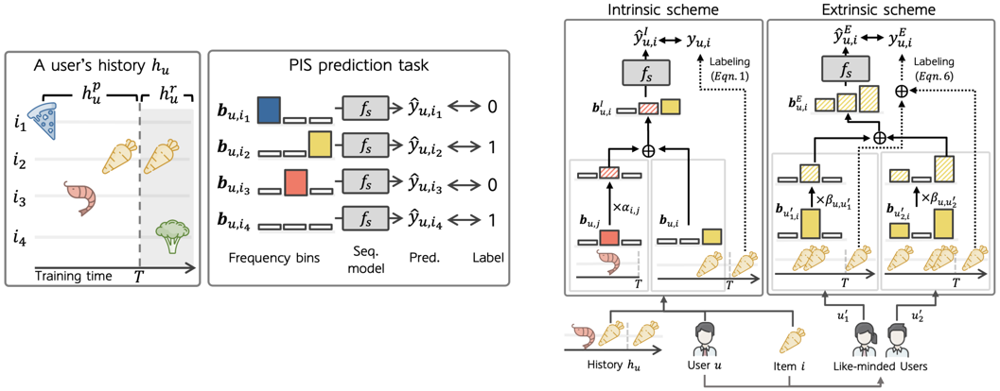
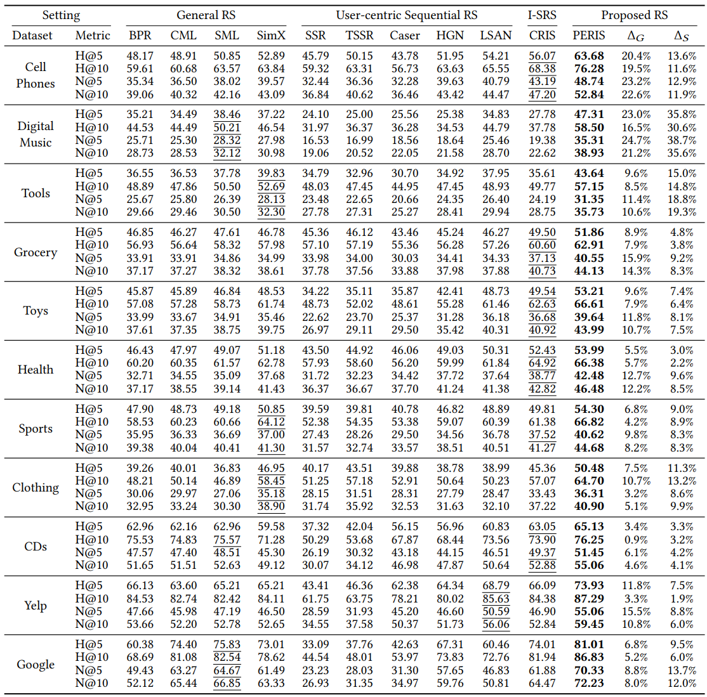

<h1 align="center">
 Beyond Learning from Next Item: Sequential Recommendation via Personalized Interest Sustainability

</h1>

       
       

Official implementation of 
<a href="https://arxiv.org/pdf/2209.06644.pdf">CIKM'22 paper</a>

## Overview
### Sequential Recommender Systems
There have been two groups of existing sequential models: user- and item-centric models. This work proposes a recommender system taking advantages of the models in both categories.

### Personalized Interest Sustainability with supplementaion schemes
We formulate a task to predict which items each user will consume in the recent period of the training time based on users' consumption history. We then devise simple yet effective schemes to supplement users’ sparse consumption history in both intrinsic and extrinsic manners.

### Recommendation Performance
PERIS significantly outperforms baseline models including general, user-centric, and item-centric sequential models on 11 real-world datasets. This result indicates the effectiveness of the personalized interest sustainability.

## Major Requirements
* Python
* Pytorch
* Numpy

## Preprocessing Data
1. Download user-item consumption data (and extract the compressed file) into `./data/`.
    * [Amazon](http://jmcauley.ucsd.edu/data/amazon/)
      <pre>[Example] <code>wget http://snap.stanford.edu/data/amazon/productGraph/categoryFiles/ratings_Cell_Phones_and_Accessories.csv</code></pre>
    * [Yelp](https://www.yelp.com/dataset)
    * [Google Maps](cseweb.ucsd.edu/~jmcauley/datasets.html)
    * Other data you want

    :exclamation: *Please make sure your data in the same csv format of Amazon data.*
    
    
 
 2. Split your data into training/validation/test data in `./data/`.
   <pre><code>python split_data.py your_decompressed_file.csv</code></pre>
 
 3. Build a dataset for training a recommender syetem with using the splitted data.
 <pre><code>python build_recdata.py generated_directory </code></pre>
 
 ## Training    
Train the proposed recommender system (PERIS).
 <pre><code>python train.py --dataset your_dataset --learning_rate 1e-3 --lamb 0.5 --mu 0.3 --K 128 </code></pre>
 
## Citation
If you use this repository for your work, please consider citing [our paper](https://arxiv.org/pdf/2209.06644):

<pre><code>@article{2209.06644,
Author = {Dongmin Hyun, Chanyoung Park, Junsu Cho, and Hwanjo Yu},
Title = {Beyond Learning from Next Item: Sequential Recommendation via Personalized Interest Sustainability},
Year = {2022},
Eprint = {arXiv:2209.06644},
Doi = {10.1145/3511808.3557415},
}
</code></pre>
